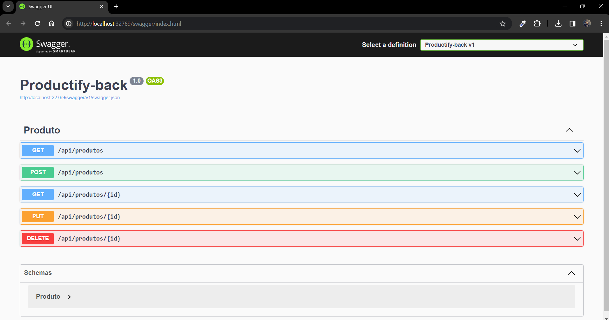
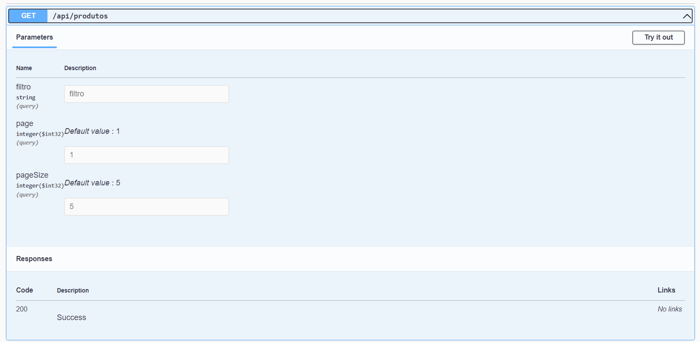
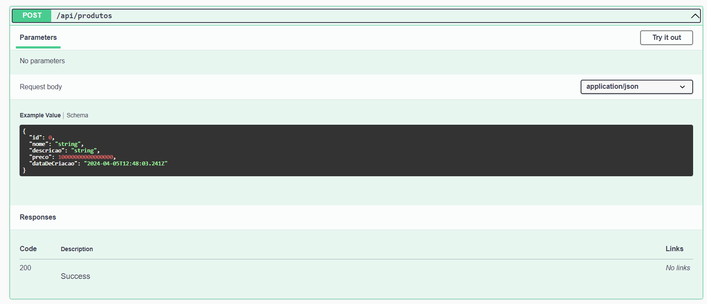
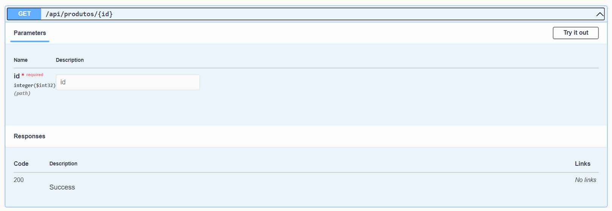
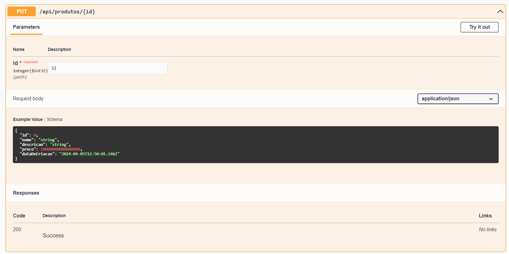
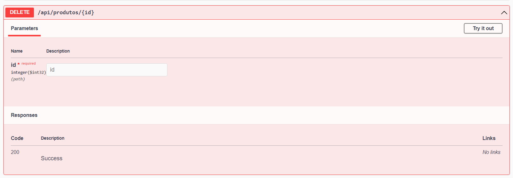

# Productify-back

O projeto productify-back é uma aplicação web ASP.NET Core que é utilizada pela interface web  [productify-front](https://github.com/vinancius/Productify-front). Juntas elas formam um sistema de gerencia de um catálogo de produtos.

## Introdução

Essas instruções permitirão que você obtenha uma cópia do projeto em operação na sua máquina local para fins de desenvolvimento.

## Construído com

De que tecnológias que você precisa instalar?

* [.NET 6.0](https://dotnet.microsoft.com/pt-br/download/dotnet/6.0) - Framework utilizado
* [Docker](https://angular.io/quick-start) - Gerenciar componentes de contêineres
* [Visual Studio](https://visualstudio.microsoft.com/pt-br/) - IDE utilizada

### Instalação e Execução

O projeto pare ser inicializado é preciso usar o docker, na pasta raiz do projeto executar os seguintes comandos:

```
docker build -t productify-back .
```

Em seguida:

```
docker-compose up -d 
```

### Banco de dados
O banco de dados utilizado foi uma SQL Server, ao iniciar o projeto com o docker-compose. 
Criamos um container com um banco SQL server que é consumido pela nossa api. Nosso contexto de conexão
cria automaticamente nosso schema no banco:


# Recursos da Api

* Endpoints disponíveis:



* Endpoint - Listar todos os produtos:



* Endpoint - Cadastrar produto:



* Endpoint - Listar produto pelo Id:



* Endpoint - Atualizar registros produto



* Endpoint - Deletar produto pelo Id:

